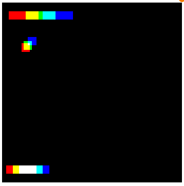

# Playing Pong using Deep Reinforcement Learning

This repository is based on a Nature paper published in ... by Google Deepmind. To familiarize myself with deep learning, reinforcement learning I've implemented the algorhighm described in the methods section of the Nature paper from scratch using PyGame and Tensorflow.

## Deep Q learning - a brief explanation

In Deep Q learning, we aim to train a [convolutional neural network](https://en.wikipedia.org/wiki/Convolutional_neural_network) that slowly learns how to play a game. The algorighm starts of with random play, and based on the rewards (winning or losing) the network slowly learns what moves are more likely to result in a successfull score given a certain state of the game.

The algorighm has 

Game implemented in pygame and numpy

`python pong_rf_gridsearch environment.yml`

['images/input_image_example.png']('hoi')