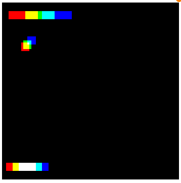
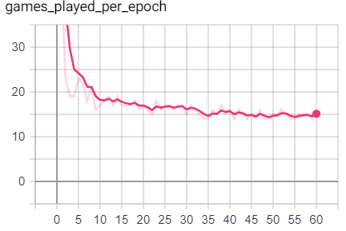
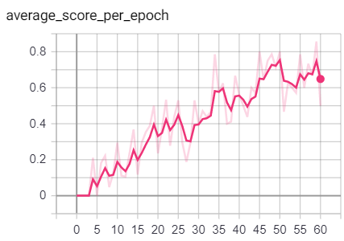
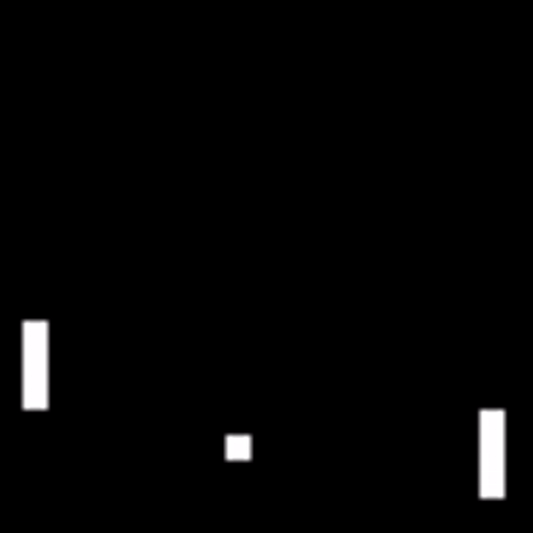

# Playing Pong using Deep Reinforcement Learning

This repository is based on a [paper](https://www.readcube.com/articles/10.1038/nature14236) published in Nature by Google Deepmind. To familiarize myself with deep learning, reinforcement learning I've implemented the algorhighm described in the methods section of the Nature paper from scratch using PyGame and Tensorflow.

## Learing to play Pong with Deep Q learning

In Deep Q learning, we aim to train a [convolutional neural network](https://en.wikipedia.org/wiki/Convolutional_neural_network) (CNN) that slowly learns how to play a game. The algorighm starts of with random play, and based on the rewards (winning or losing) the network slowly learns playing moves to progress to games states with a higher probability to win.

The input for the CNN are frame containing raw pixels, it does not have any prior knowledge about the game. The CNN is fed with stacks of consequtive frames, see image below. The algoritm needs at least 2 consequtive frames to anticipate based on the speed of the ball. 

|

## Installing dependencies

Install dependencies in a new anaconda environment and activate the environment (tested on Windows):

```
conda env create -f environment.yml
conda activate pong_rf
```

## Training the network

Reinforcement and CNN hyperparameters are specified in the params.yml. If hyperparamters are provided in a list, a grid search will automatically be initiated and results are stored in subdirectories. To excecute training and store results in the exp subdirectory run:

`python pong_rf.py params.yml exp`

Follow the results online in tensorboard by running:

`tensorboard --logdir exp --host localhost --port 8008`

## Expected Results

After several hours of training, the algorithm slowly learns how to beat the hard coded pong opponent. The games take longer, and the average score per epoch increases. Better results are likely be obtained by extstensive hyperparamter tuning and longer training times.

Games played per epoch|Average score per epoch
:-:|:-:
|

Moreover, the algorightm visually improves it's gameplay. In both examples, the algorithm is the left player

Random play | Experienced play
:-:|:-:
 | 
